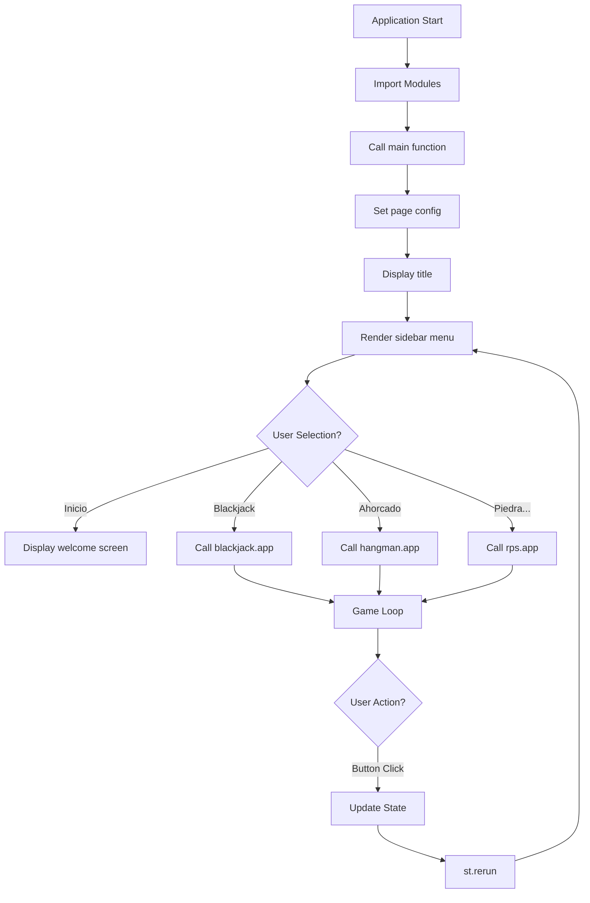

## Project Structure

Python Arcade Suite is built with a modular architecture that separates concerns between the main application router and individual game modules. This design enables easy maintenance, scalability, and the ability to add new games without modifying existing code.

### Directory Layout

```
python-arcade-suite/
├── streamlit_app.py              # Main entry point and router
├── blackjack/
│   └── streamlit_game.py         # Blackjack game module
├── Hangman/
│   ├── streamlit_game.py         # Hangman game module
│   └── DATA/
│       └── DATA.txt              # Word list for Hangman
└── Rock_paper_or_scissors/
    └── streamlit_game.py         # Rock Paper Scissors module
```

<Note>
Each game is self-contained in its own directory with a `streamlit_game.py` file that exposes an `app()` function. This consistent interface makes the router simple and predictable.
</Note>

## Main Application Router

The main application (`streamlit_app.py`) serves as the central hub, handling navigation and delegating to individual game modules.

### Entry Point

```python
if __name__ == "__main__":
    main()
```

The application follows standard Python conventions with a `main()` function as the entry point. This function is called when the script is executed directly.

### Module Import Strategy

```python
import streamlit as st
from blackjack import streamlit_game as blackjack
from Hangman import streamlit_game as hangman
from Rock_paper_or_scissors import streamlit_game as rps
```

**Key Design Decisions:**
- **Namespace Aliasing**: Each game module is imported with a short alias (`blackjack`, `hangman`, `rps`) for cleaner code
- **Consistent Interface**: All games expose an `app()` function that can be called uniformly
- **Lazy Loading**: While imports happen at startup, game logic only executes when selected

## Navigation System

The application uses Streamlit's sidebar for game selection, implementing a simple but effective routing pattern.

### Sidebar Menu Configuration

```python
game_choice = st.sidebar.selectbox(
    "Elige un juego",
    ("Inicio", "Blackjack", "Ahorcado", "Piedra, Papel o Tijeras")
)
```

<Warning>
The game names in the selectbox are in Spanish. When extending the application, ensure consistency in language across all game options.
</Warning>

### Routing Logic

The router uses a simple conditional chain to delegate control to the appropriate game module:

```python
if game_choice == "Inicio":
    st.header("Bienvenido a la colección de Juegos Simples")
    st.markdown("""
    Esta aplicación contiene tres juegos clásicos:
    
    1.  **Blackjack 🃏**: Intenta llegar a 21 sin pasarte.
    2.  **Ahorcado 🔤**: Adivina la palabra antes de que se acaben los intentos.
    3.  **Piedra, Papel o Tijeras ✂️**: Juega contra la computadora.
    
    ¡Selecciona uno en la barra lateral para empezar!
    """)
elif game_choice == "Blackjack":
    blackjack.app()
elif game_choice == "Ahorcado":
    hangman.app()
elif game_choice == "Piedra, Papel o Tijeras":
    rps.app()
```

### Page Configuration

```python
st.set_page_config(page_title="Menú de Juegos", page_icon="🎮")
```

The page config is set once at the start of the main function, establishing:
- **Page Title**: Appears in browser tab
- **Page Icon**: Emoji displayed in browser tab

<Note>
`st.set_page_config()` must be called before any other Streamlit commands. This is why it's placed at the very beginning of the `main()` function.
</Note>

## Module Design Patterns

Each game module follows a consistent architectural pattern:

### 1. Initialization Function

Every game has an `init_game()` function that sets up the initial state:

<Tabs>
  <Tab title="Blackjack">
    ```python
    def init_game():
        st.session_state.deck = deck_of_cards()
        st.session_state.player_hand = []
        st.session_state.dealer_hand = []
        
        # Initial deal
        for _ in range(2):
            card = random.choice(st.session_state.deck)
            st.session_state.deck.remove(card)
            st.session_state.player_hand.append(card)
            
            card = random.choice(st.session_state.deck)
            st.session_state.deck.remove(card)
            st.session_state.dealer_hand.append(card)
        
        st.session_state.game_over = False
        st.session_state.result_message = ""
    ```
  </Tab>
  <Tab title="Hangman">
    ```python
    def init_game():
        filepath = os.path.join("Hangman", "DATA", "DATA.txt")
        words = read_words_from_file(filepath)
        st.session_state.hangman_word = random.choice(words)
        st.session_state.hangman_guessed = set()
        st.session_state.hangman_attempts = 6
        st.session_state.hangman_game_over = False
        st.session_state.hangman_result = ""
    ```
  </Tab>
  <Tab title="Rock Paper Scissors">
    ```python
    def init_game():
        st.session_state.rps_user_score = 0
        st.session_state.rps_computer_score = 0
        st.session_state.rps_round_result = ""
        st.session_state.rps_history = []
    ```
  </Tab>
</Tabs>

### 2. App Function

The `app()` function serves as the module's entry point and main render loop:

```python
def app():
    st.header("🃏 Blackjack")

    if 'deck' not in st.session_state or 'player_hand' not in st.session_state:
        init_game()

    # Rest of game logic...
```

This function:
- Sets the page header
- Checks if state exists and initializes if needed
- Renders the UI
- Handles user interactions

### 3. Helper Functions

Each game includes domain-specific helper functions:

<CodeGroup>
```python Blackjack Helpers
def deck_of_cards():
    """Generate a standard 52-card deck"""
    DoC = []
    numbers = ["A", "2", "3", "4", "5", "6", "7", "8", "9", "10", "J", "Q", "K"]
    suits = ["♣", "♠", "♥", "♦"]
    for suit in suits:
        for number in numbers:
            card = f"{number}{suit}"
            DoC.append(card)
    return DoC

def card_value(card):
    """Calculate the value of a single card"""
    if card[:-1] in ['K', 'Q', 'J', '10']:
        return 10
    elif card[0] == 'A':
        return 11
    else:
        return int(card[:-1])
```

```python Hangman Helpers
def read_words_from_file(filepath):
    """Load word list from external file"""
    try:
        with open(filepath, 'r', encoding='utf-8') as file:
            words = [line.strip().upper() for line in file if line.strip()]
        return words
    except FileNotFoundError:
        return ["PYTHON", "STREAMLIT", "DEVELOPER", "AHORCADO"]

def get_hangman_art(attempts_left):
    """Return ASCII art based on remaining attempts"""
    mapping = {6: "empty gallows", 5: "head", ...}
    return mapping.get(attempts_left, "")
```

```python RPS Helpers
def get_winner(user, computer):
    """Determine the winner of a round"""
    if user == computer:
        return "Empate"
    elif (user == "Piedra" and computer == "Tijera") or \
         (user == "Papel" and computer == "Piedra") or \
         (user == "Tijera" and computer == "Papel"):
        return "Usuario"
    else:
        return "Computadora"
```
</CodeGroup>

## Separation of Concerns

The architecture demonstrates clear separation of concerns:

| Layer | Responsibility | Files |
|-------|----------------|-------|
| **Router** | Navigation, page config, menu display | `streamlit_app.py` |
| **Game Logic** | Game rules, state management, win/loss conditions | `*/streamlit_game.py` |
| **Data** | External resources (word lists, etc.) | `Hangman/DATA/DATA.txt` |

### Benefits of This Architecture

<Tabs>
  <Tab title="Maintainability">
    - Each game is isolated in its own module
    - Changes to one game don't affect others
    - Clear boundaries make debugging easier
    - New developers can understand individual games without knowing the entire system
  </Tab>
  <Tab title="Scalability">
    - Adding a new game requires:
      1. Creating a new directory with `streamlit_game.py`
      2. Adding an import statement
      3. Adding a menu option and routing condition
    - No changes needed to existing games
    - Each game can grow in complexity independently
  </Tab>
  <Tab title="Testability">
    - Helper functions are pure and easily testable
    - Game modules can be imported and tested in isolation
    - Mock session state for unit testing
  </Tab>
</Tabs>

## Application Lifecycle



<Note>
Streamlit re-runs the entire script from top to bottom on every user interaction. The session state persists between re-runs, which is crucial for maintaining game state.
</Note>

## Best Practices Demonstrated

1. **Consistent Interface Pattern**: All games expose an `app()` function
2. **Namespacing**: Session state keys are prefixed by game (e.g., `rps_user_score`, `hangman_word`)
3. **Error Handling**: Hangman includes fallback word list if file not found
4. **Single Responsibility**: Each function has one clear purpose
5. **Configuration First**: Page config set before any UI rendering

## Extending the Architecture

To add a new game:

1. **Create game directory**:
   ```bash
   mkdir new_game
   touch new_game/streamlit_game.py
   ```

2. **Implement required functions**:
   ```python
   # new_game/streamlit_game.py
   def init_game():
       # Initialize game state
       pass
   
   def app():
       # Main game logic
       pass
   ```

3. **Update router**:
   ```python
   # streamlit_app.py
   from new_game import streamlit_game as new_game
   
   game_choice = st.sidebar.selectbox(
       "Elige un juego",
       ("Inicio", "Blackjack", "Ahorcado", "Piedra, Papel o Tijeras", "New Game")
   )
   
   # Add routing condition
   elif game_choice == "New Game":
       new_game.app()
   ```

The modular architecture makes this extension process straightforward and predictable.